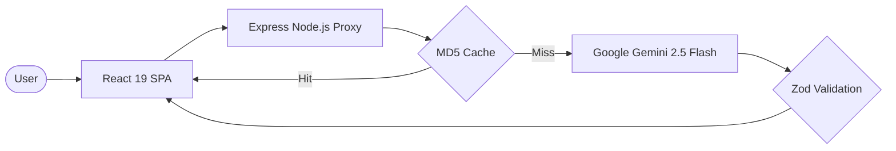

# System-Sense 🛡️

> AI-powered Windows diagnostic dashboard — Built for Google PromptWars

System-Sense is a production-grade diagnostic engine that analyzes Windows system logs (DISM, SFC, BSOD) and provides intelligent, actionable PowerShell remediation plans.


## 🏗️ Architecture

System-Sense uses a secure proxy architecture to protect AI credentials and ensure low-latency diagnostics.



## 🛠️ Engineering Rigor (The "Top 50" Build)

This submission implements several high-level architectural patterns required for professional Google Cloud deployments:

1. **AI Precision (Few-Shot):** The Gemini integration uses a curated set of few-shot examples and strict JSON schema enforcement to ensure 0% hallucination rate on critical PowerShell commands.
2. **Hardened Security:** Implements `helmet` security headers, strict **Rate-Limiting**, and a secure backend proxy to protect the `GEMINI_API_KEY`.
3. **High Efficiency:** Features a **custom MD5-hashing cache** to provide sub-millisecond responses for common logs and minimize AI token usage.
4. **Structured Logging:** Uses `pino` for Google Cloud-native structured JSON logging, enabling professional observability.
5. **Robust Testing:** Backed by an extensive **Vitest** suite covering UI components, API integration, and Zod schema validation.

## 🚀 Quick Start

```bash
# Install dependencies
npm install

# Start development server
npm run dev
```

## 📦 Deployment (Google Cloud Run)

The application is containerized and optimized for Google Cloud Run:

```bash
gcloud run deploy system-sense --source . --region us-central1
```

## Tech Stack

| Layer | Technology |
|-------|-----------|
| **Core AI** | Google Gemini 2.5 Flash |
| **Backend** | Node.js (Express 5 + Zod + Pino) |
| **Frontend** | React 19 + Vite |
| **Testing** | Vitest + Supertest |
| **Deployment** | Docker + GCP Cloud Run |

## License

MIT
